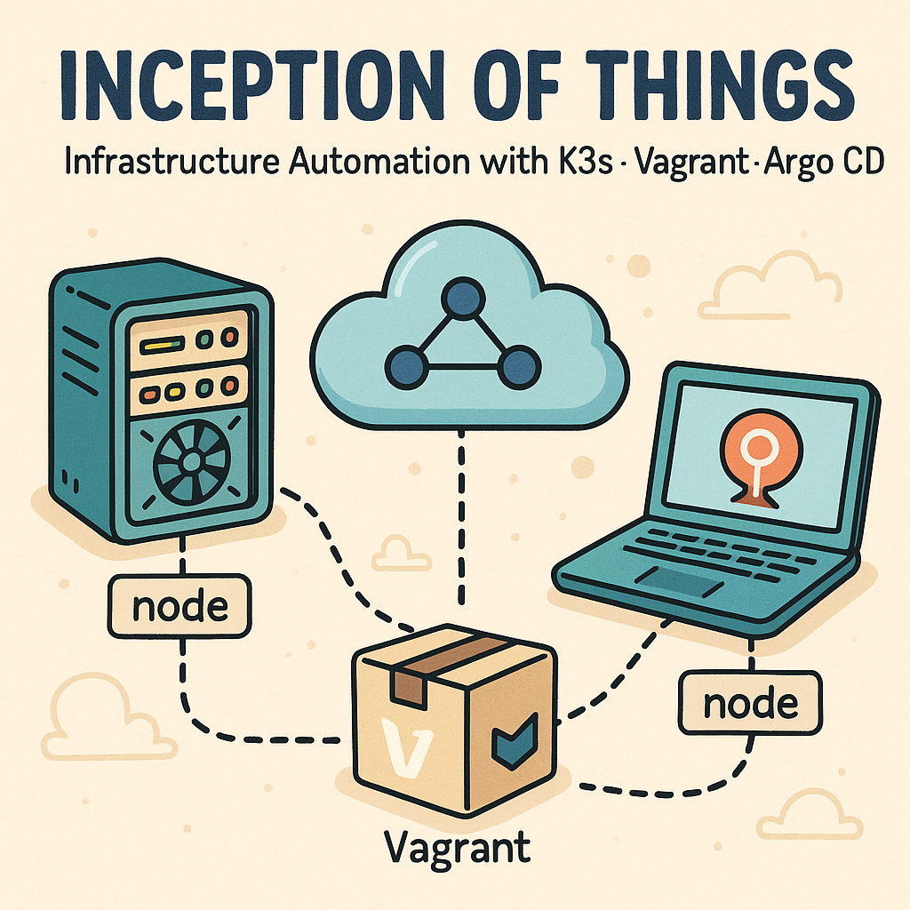

## 📖 Project Overview

**Inception of Things (IoT)** is a comprehensive DevOps project that focuses on setting up and managing Kubernetes clusters using **K3s** in virtualized environments. This project demonstrates the complete lifecycle of containerized application deployment, from infrastructure provisioning with **Vagrant** to container orchestration with **Kubernetes**.

### 🎯 Key Objectives
- Learn **Infrastructure as Code** principles using Vagrant
- Master **K3s** (lightweight Kubernetes) deployment and management
- Implement **GitOps** workflows and CI/CD pipelines
- Practice **container orchestration** and service mesh concepts
- Understand **virtualization** and **nested virtualization** requirements

### 🏗️ Project Structure
- **P1**: Basic K3s cluster setup with server and worker nodes
- **P2**: Advanced cluster configuration with applications and ingress
- **P3**: CD pipeline implementation with GitOps principles
- **Bonus**: CI / CD pipeline implementation with GitOps principles

---

## ⚙️ Prerequisites

**IMPORTANT:** Before starting, ensure proper virtualization setup.

## 🖥️ Setting Up the Project Host Virtual Machine

Follow these steps to create and configure a VirtualBox VM for the project. This setup is tailored for the 42 School cluster and ensures stable performance.

---

### 1. **Download Ubuntu Server 22.04 LTS**

- Visit the [Ubuntu Server Downloads](https://ubuntu.com/download/server) page.
- Download the **Ubuntu Server 22.04 LTS** `.iso` file.
- Save it to a known location on your computer.

---

### 2. **Create a New Virtual Machine in Oracle VirtualBox**

- Open **Oracle VirtualBox**.
- Go to **Machine → New**.
- Configure the VM:
  - **Name:** Any (e.g., `iot_vm`)
  - **ISO Image:** Select the Ubuntu Server `.iso` you downloaded.
  - **Guest Additions:** **Do NOT enable** (can cause instability).
  - **Base Memory (RAM):** Allocate as much as possible (suggested: **11 GB**).
  - **Processors:** **16 CPUs**
  - **Disk Size:** **80 GB** (for images and installations)
- Start the installer and complete Ubuntu installation.

---

### 3. **Configure Virtual Machine Settings**

After installing Ubuntu, shut down the VM and adjust these settings:

- In VirtualBox, select your VM and click **Settings**.
- Go to **Network** (switch to *Expert Mode*):
  - **Adapter 1:**
    - Enable Network Adapter
    - Attached to: **NAT**
    - Cable Connected: **Checked**
    - Click **Port Forwarding** and add:
      | Name    | Protocol | Host Port | Guest Port |
      |---------|----------|-----------|------------|
      | ArgoCD  | TCP      | 8080      | 8080       |
      | GitLab  | TCP      | 8888      | 8888       |
      | SSH     | TCP      | 2222      | 22         |
- Go to **System → Processor**:
  - Enable only: **Enable Nested VT-x/AMD-V**

---

### 4. **Enable SSH on the VM**

Start your VM and run:

```bash
sudo apt update
sudo apt install openssh-server
sudo systemctl enable ssh
sudo systemctl start ssh
```

---

### 5. **Configure SSH Access from Your Host Machine**

On your host (not the VM), add an SSH config entry (replace `myuser` with your Ubuntu username):

```bash
echo -e "\nHost iot_vm\n    HostName localhost\n    User myuser\n    Port 2222" >> ~/.ssh/config
```

Connect to your VM:

```bash
ssh iot_vm
```

---

### 6. **Transfer Project Setup Files to the VM**

From your host, copy the setup files:

```bash
scp -r iot-hihi/configure iot_vm:~/
scp -r iot-hihi/config-aliases iot_vm:~/
```

---

### 7. **Run the Setup Scripts**

In the VM terminal:

```bash
chmod +x configure config-aliases
./configure
./config-aliases
./configure   # Run again due to dependencies
```

---

### 8. **Clone the Project Repository Inside the VM**

```bash
git clone <repository_url>
```

---

✅ **Your VM is now fully set up and ready to use!**


### Prerequisite (but also already added to the makefile!)
IMPORTANT:
    Inside the virtual machine, open a terminal and type

    sudo rmmod kvm_intel
    sudo rmmod kvm

    this will remove a restriction to create and share hardware virtualization

FYI: 
    The virtual machines inside vagrant need at least 2048,
    because k3s already takes around 1GB -> ssh will not be possible / will hang, because not enough memory. 
    1 CPU otherwise it might hang (?)

# About k3s
## firewall
It is recommended to turn off ufw (uncomplicated firewall) in your host (the host VM):
`ufw disable`

## k3s Hardware
Hardware requirements scale based on the size of your deployments. The minimum requirements are:

| Node   | CPU     | RAM    |
|--------|---------|--------|
| Server | 2 cores | 2 GB   |
| Agent  | 1 core  | 512 MB |


etcd is write intensive; SD cards and eMMC cannot handle the IO load.


# p2

- All traffic goes to the same IP.
- The Ingress controller routes requests based on the `Host` header.
- You see the correct app depending on the hostname in your browser.
- If the hostname doesn’t match app1 or app2, app3 is shown by default.


- **Ingress Controller** (the purple icon in the center) is deployed in your k3s cluster.
- The **client** (your computer) sends HTTP requests to `192.168.56.110` but sets the `Host` header to `app1.com`, `app2.com`, or `app3.com`.
- The **Ingress Controller** inspects the `Host` header and routes the request to the correct app/service:
  - If `Host: app1.com` → route to **App 1**
  - If `Host: app2.com` → route to **App 2**
  - If `Host: app3.com` or anything else → route to **App 3** (default backend)

Key points from the setup:
One VM (IP: 192.168.56.110) running k3s.
Multiple apps (app-one, app-two, app-three) deployed as Kubernetes deployments and services.
Ingress Controller routes requests based on the Host header:
app1.com → app-one
app2.com → app-two
Any other host (or default) → app-three
The hosts file on the local machine maps all hostnames to the VM IP.

You can test routing with 
```
curl -H "Host:app2.com" 192.168.56.110
``` 
and see the correct app response.

the structure is 
iot-hihi/
├── p1/
│   └── ...                # Part 1 files
├── p2/
│   ├── infra/
│   │   ├── Vagrantfile
│   │   ├── k8s/
│   │   │   └── ingress.yaml
│   │   └── server.sh
│   └── apps/
│       ├── app1/
│       │   ├── Dockerfile
│       │   └── k8s/
│       │       ├── deployment.yaml
│       │       └── service.yaml
│       ├── app2/
│       │   ├── Dockerfile
│       │   └── k8s/
│       │       ├── deployment.yaml
│       │       └── service.yaml
│       └── app3/
│           ├── Dockerfile
│           └── k8s/
│               ├── deployment.yaml
│               └── service.yaml
├── makefile
└── README.md

## Ingress

An Ingress in Kubernetes is an API object that manages external access to services in a cluster, typically HTTP/HTTPS.
It acts as a smart router, forwarding requests to the correct service based on rules like hostnames or paths.

Listens for requests to app1.com, app2.com, or app3.com
Routes each to its respective service (app1-service, app2-service, app3-service)
Has a default rule to send unmatched requests to app3-service

How to Verify Ingress Is Working
```
k get ingress
k describe ingress app-ingress
```
Make sure your hosts maps all domains to your VM IP:
```
192.168.56.110 app1.com
192.168.56.110 app2.com
192.168.56.110 app3.com
```

Use curl to test each app:
```
curl -H "Host:app1.com" http://192.168.56.110
curl -H "Host:app2.com" http://192.168.56.110
curl -H "Host:app3.com" http://192.168.56.110
curl -H "Host:unknown.com" http://192.168.56.110  # Should route to app3-service (default)
```

# P3

## K3S vs K3D

- K3S: A lightweight Kubernetes distribution designed to run directly on VMs or physical machines. You installed it previously using Vagrant and shell scripts.
-K3D: A tool that runs K3S clusters inside Docker containers. It’s much faster to spin up, easier to tear down, and great for local development and CI/CD. No need for Vagrant or VirtualBox—just Docker.

We will use the premade Wil’s application on Dockerhub here:
https://hub.docker.com/r/wil42/playground.
The application uses port 8888.
(Find the two versions in the TAG section)

# commands
after running the script `start-p3` you can check the namespaces with 
```
k get ns
```
and 
```bash
k get pods -n dev
# or
kubectl describe pod playground -n dev
```

## resources
The official documentation for k3s  
https://docs.k3s.io/
install script for k3s (example)  
https://get.k3s.io/

stack overflow  
https://stackoverflow.com/a/24869194  

for p1 i also found this image  
https://portal.cloud.hashicorp.com/vagrant/discover/alpine/alpine64  