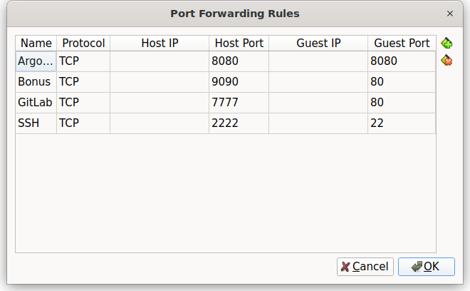

# Bonus: Local GitLab for Part 3

This folder installs a local GitLab and redirects your Argo CD Application to a GitLab repository, as required by the bonus.

## What it does
- Installs `ingress-nginx` (Traefik is disabled in your k3d config)
- Exposes k3d load balancer on host ports **80, 443**, and **8888**
- Installs GitLab CE via Helm in namespace **gitlab**
- Applies an Argo CD `Application` that points to `http://gitlab.iot.local/root/wilapp-deploy.git`


# Step 1: Start the local GitLab instance
```bash
cd bonus/scripts
bash start_bonus.sh
```

To remove:
```bash
bash delete_bonus.sh
```

# Step 2: Set up GitLab repository and import code

Please ensure that the port forwarding is set up correctly:


After starting the cluster with ./start_bonus.sh, GitLab is accessible at 'http://localhost:<Port>'.

## 1. Log in to GitLab

- Username: `root`
- Password: The password is printed in the terminal after executing the startup script. Alternatively you can retrieve it with:

```bash
kubectl -n gitlab get secret gitlab-gitlab-initial-root-password   -o jsonpath='{.data.password}' | base64 -d; echo
```

## 2. Create a new project

In the GitLab web interface, create a new blank project:

**Important**: Create a **blank repository** (no README, no license, etc.).

1. **New Project** → **Create Project**.
2. **Name**: `wilapp-deploy`
3. In project URL add Group: `root`
4. Visibility: _Private_ (or _Public_, if desired).
5. You can untick any other options
6. Click **Create Project**.

## 3. Import code from GitHub

On your VM:

```bash
cd ~
git clone https://github.com/panndabea/wilapp-deploy.git
cd wilapp-deploy
git remote set-url origin http://localhost/root/wilapp-deploy.git
git push --all origin
git push --tags origin
```
Username 'root'
PW is the same we got earlier in the terminal

When completing this step your new GitLab repository will contain the complete code from GitHub.

# Step 3: Create Argo CD Application and deploy wilapp

In this step, Argo CD connects to **your local GitLab** and deploys the app in the **`dev`** namespace.

---

## 0) Check initial state
Ensure you are in the bonus folder of the project first
```bash
k3d kubeconfig get iot-cluster > /tmp/k.yaml
export KUBECONFIG=/tmp/k.yaml
kubectl get nodes
kubectl -n dev get deploy,svc,pods
kubectl -n argocd get applications.argoproj.io wilapp
```

---

## 1) Create Argo CD Application YAML
If all is right, you should have the file `~/iot-hihi/bonus/confs/argocd-app-from-gitlab.yaml`:
With the following content:
```yaml
apiVersion: argoproj.io/v1alpha1
kind: Application
metadata:
  name: wilapp
  namespace: argocd
spec:
  project: default
  source:
    repoURL: http://gitlab-webservice-default.gitlab.svc:8181/root/wilapp-deploy.git
    targetRevision: main
    path: manifests
  destination:
    server: https://kubernetes.default.svc
    namespace: dev
  syncPolicy:
    automated:
      prune: true
      selfHeal: true
    syncOptions:
      - CreateNamespace=true
```

---

## 2) Apply the application & trigger sync
Ensure you are in the bonus folder of the project first (e.g. /home/alimpens/iot_aug11/bonus)
```bash
kubectl apply -f confs/argocd-app-from-gitlab.yaml
# Trigger hard refresh (optional, but practical)
kubectl -n argocd annotate app wilapp argocd.argoproj.io/refresh=hard --overwrite
```

Argo CD now fetches the manifests from `path: manifests` and creates the `dev` namespace if it doesn't exist.

---

## 3) Check status (make sure you pushed something to the repo before)
```bash
kubectl -n dev get deploy,svc,pods
```
You should see (example):
```
deployment.apps/wilapp   1/1   1   1   1m
service/wilapp          ClusterIP  10.43.x.y   <none>   8888/TCP   1m
```
> **Note:** This can easily take 5 minutes to become visible, you can also check with htop, the size should be around 5GB.
---

## 4) Argo CD UI (optional)
```bash
# Admin password retrieval
kubectl -n argocd get secret argocd-initial-admin-secret -o jsonpath='{.data.password}' | base64 -d; echo
```
In your browser: `http://localhost:9090/argocd` → Login with `admin` and the password retrieved above.

---

## 5) Test wilapp within the VM (Port-Forward)
```bash
kubectl -n dev port-forward svc/wilapp 8080:8888
# new terminal (within the VM):
curl http://localhost:8080/
```

**From the host** (outside the VM), you can also access it via VirtualBox NAT forwarding, e.g. Host **7777** → Guest **8080** and then in the browser `http://localhost:7777/`.

---

## 6) Test version bump as in part 3
Change the image tag (e.g. `v1` → `v2`) in the manifest under `manifests/...`, commit + push.  
Argo CD should automatically **sync** and roll out the new version.

---

## 7) Change image tag in the repo

### Variant A: Plain Manifests
Open the deployment file in the `wilapp-deploy` repo (e.g. `manifests/deployment.yaml`) and change **`spec.template.spec.containers[0].image`** to the new tag (e.g. `v2`).

```yaml
# Example (Snippet)
spec:
  template:
    spec:
      containers:
        - name: wilapp
          image: panndabea/wilapp:v2    # <--- neuen Tag setzen
          ports:
            - containerPort: 8888
```

Commit & Push:
```bash
cd ~/wilapp-deploy
git checkout -b bump/v2 || git checkout bump/v2
git add -A
git commit -m "bump: wilapp to v2"
git push -u origin HEAD
# Merge GitLab in the Merge Request or push directly to main:
git checkout main
git merge --no-ff bump/v2 -m "merge bump v2"
git push origin main
```

### Option B: Customize (if available)
If your repo uses `kustomization.yaml`, set the new tag there:
```yaml
images:
  - name: panndabea/wilapp
    newTag: v2
```
Afterwards commit & push as above.

---

## 8) Observe Argo CD Auto-Sync
Argo CD detects the commit and rolls it out.

```bash
# Check rollout status
kubectl -n dev rollout status deploy/wilapp --timeout=5m

# Is the new pod visible?
kubectl -n dev get pods -o wide
```

Argo CD UI (optional): `http://localhost:9090/argocd` (Login `admin`, PW via Secret like in step 3).

---

## 9) Smoke-Test

### In the VM (Port-Forward)
```bash
kubectl -n dev port-forward svc/wilapp 8080:8888
# New terminal:
curl -i http://localhost:8080/
```

### From the host (Optional, if NAT forwarding is set: Host 7777 -> Guest 8080)
```bash
curl -i http://localhost:7777/
```

---

## 10) Rollback (quick)

### Git-History revert
```bash
cd ~/wilapp-deploy
git revert -m 1 HEAD     # if MR merge commit; else: git revert <commit>
git push origin main
```
Argo CD automatically rolls back to the previous version.

### Alternatively: Reset tag
Check in `image: ...:v1` again and push.

---

## Troubleshooting

- **App-Status „Unknown“ + Log mentions `dial tcp [::1]:80`**  
  Your `repoURL` is still pointing to `http://localhost/...`. Argo CD runs inside the cluster; for Argo, `localhost` is the pod itself.  
  → Change `repoURL` to `http://gitlab-webservice-default.gitlab.svc:8181/...` and re-run `kubectl apply`.

- **Repo is private → Auth error**  
  Either make the project **Public** or create a **Deploy Token**/**PAT** in GitLab (`read_repository`) and store it in Argo CD as a **Repository Credential**.

- **Namespace `dev` is missing**  
  Pay attention to `syncOptions: ["CreateNamespace=true"]` *or* create it manually:  
  `kubectl create ns dev`

## Files
- `confs/k3d-cluster-bonus.yaml` – k3d config mapping 80/443/8888 on the load balancer
- `confs/ingress-nginx-values.yaml` – minimal values for ingress-nginx
- `confs/gitlab-values.yaml` – slim GitLab demo values (no TLS, registry off)
- `confs/argocd-app-from-gitlab.yaml` – Argo CD Application pointing to local GitLab
- `scripts/start_bonus.sh` – one-shot installer
- `scripts/delete_bonus.sh` – cleanup

## 5) Troubleshooting

- **Argo CD shows "OutOfSync" / "Unknown"**  
  → `kubectl -n argocd annotate app wilapp argocd.argoproj.io/refresh=hard --overwrite`  
  → Open UI, possibly click "Sync".

- **Rollout stuck** (`progressDeadlineExceeded`)  
  → Check `kubectl -n dev describe deploy/wilapp`. Common causes: incorrect image tag, missing container port, incorrect service port.

- **Private Repo  → missing access**  
  → In GitLab Deploy Token or Personal Access Token with `read_repository` create and store in Argo CD as **Repository Credential**.

---

Ready 🎉 — with this the bonus part is reproducible: Version bump → Auto-Deploy via Argo CD → test → roll back if necessary.