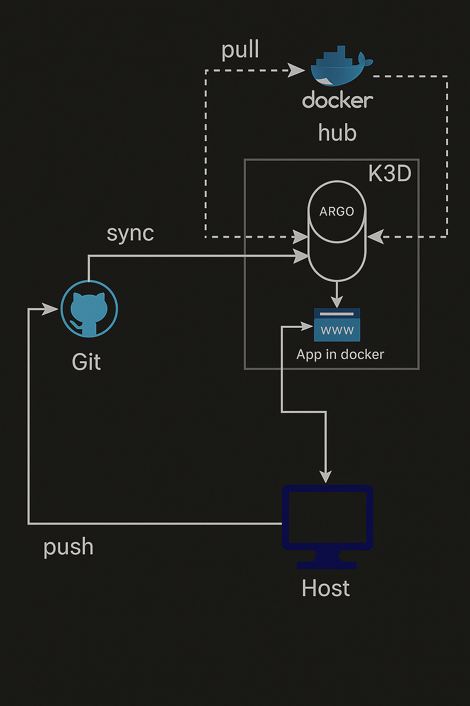

# 🎯 Part 3 (P3) - Advanced K3s with CI/CD Pipeline

This part demonstrates an advanced K3s setup with continuous integration and deployment capabilities, showcasing GitOps workflows and automated application deployment.

Here a diagram of the architecture used in this part:

